# 📚 Flutter Comic App - Built with Flutter, BLoC, REST API, Firebase Auth.


## 📱 Working application

Check out the **live web demo** -> _coming soon_ 

<table>
  <tr>
    <th>Screen</th>
    <th>Preview</th>
    <th>Screen</th>
    <th>Preview</th>
  </tr>
  <tr>
    <td><strong>Begin Screen</strong></td>
    <td>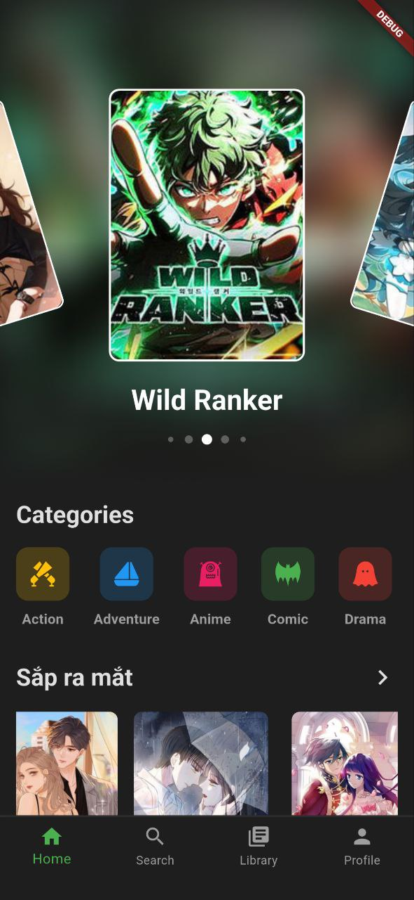</td>
    <td><strong>Home Screen</strong></td>
    <td>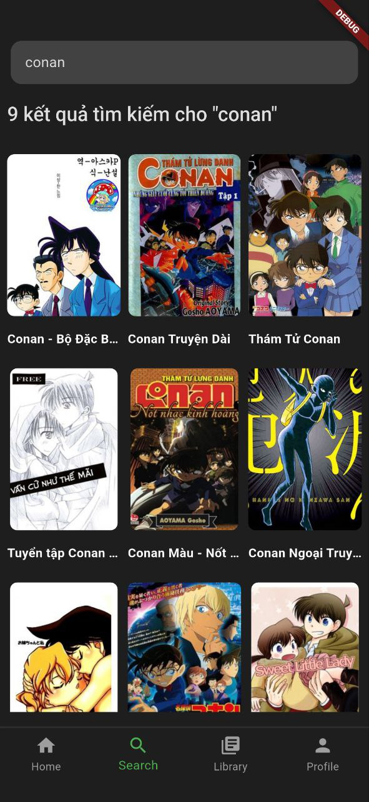</td>
  </tr>
  <tr>
    <td><strong>Category Screen</strong></td>
    <td>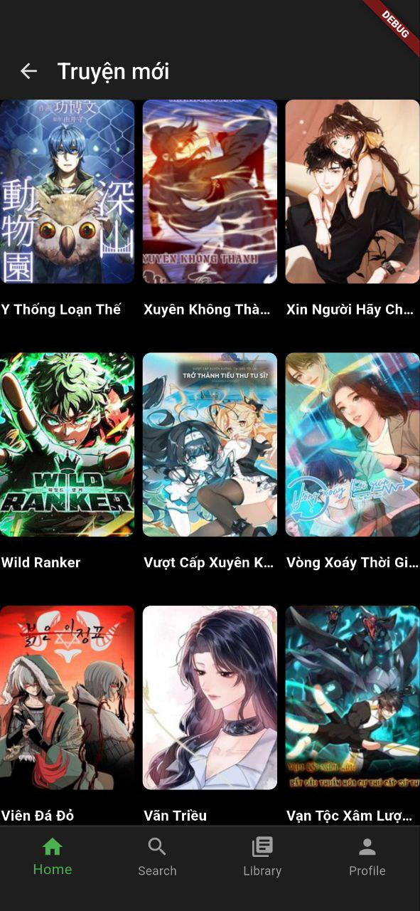</td>
    <td><strong>Search Screen</strong></td>
    <td>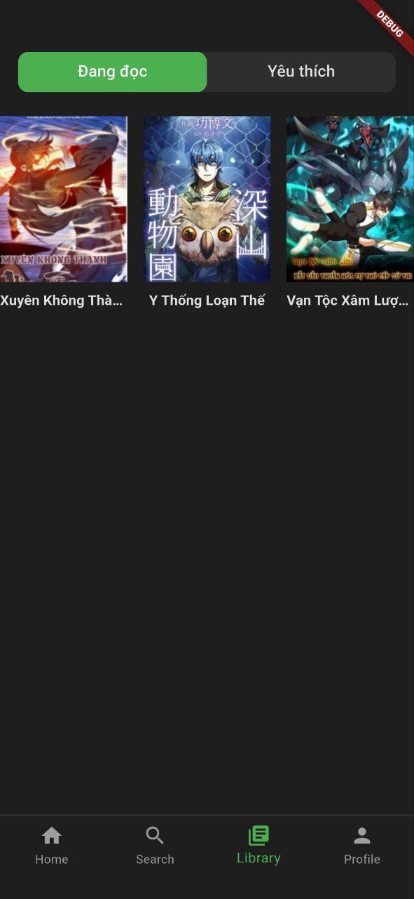</td>
  </tr>
  <tr>
    <td><strong>Library Screen</strong></td>
    <td>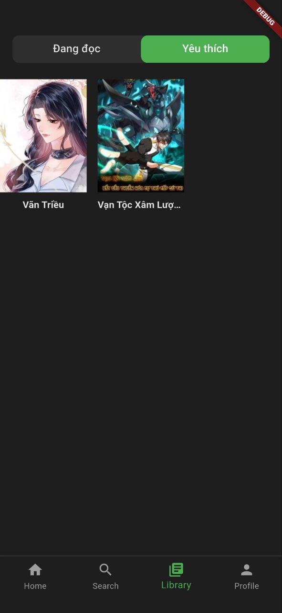</td>
    <td><strong>Login Screen</strong></td>
    <td>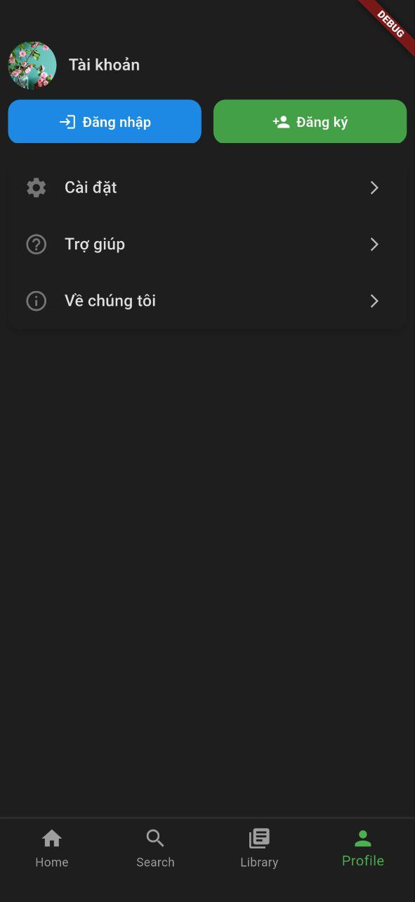</td>
  </tr>
  <tr>
    <td><strong>Comic Detail Screen</strong></td>
    <td>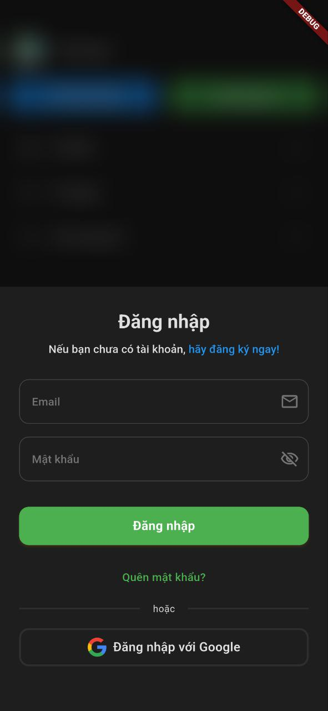</td>
    <td><strong>Reading Screen</strong></td>
    <td>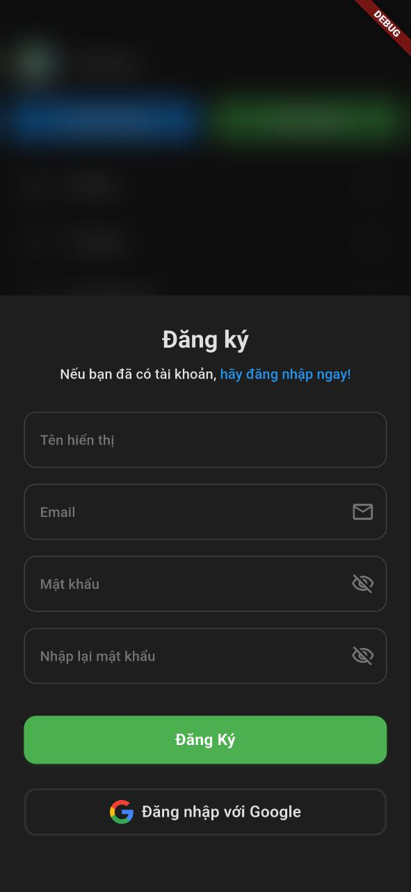</td>
  </tr>
  <tr>
    <td><strong>Comment Screen</strong></td>
    <td>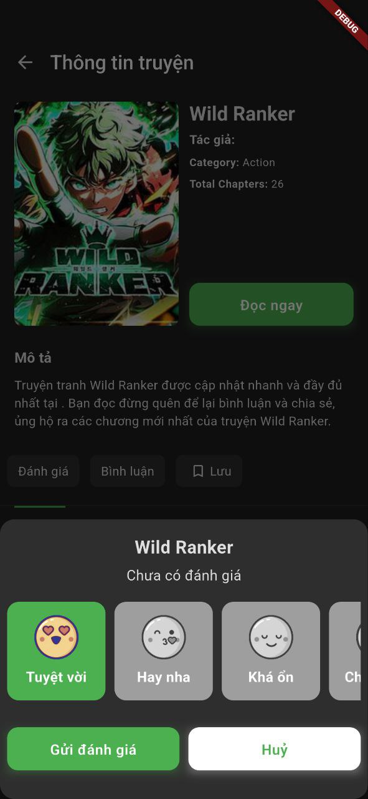</td>
    <td><strong>Rating Screen</strong></td>
    <td>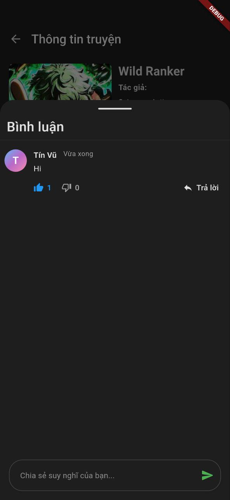</td>
  </tr>
  <tr>
    <td><strong>Category Detail Screen</strong></td>
    <td>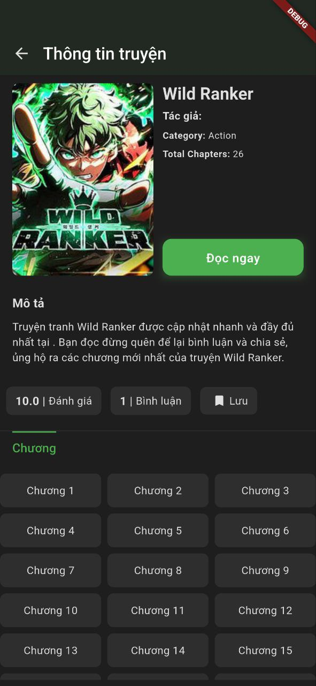</td>
    <td><strong>Search Result Screen</strong></td>
    <td></td>
  </tr>
</table>


## 📚 Flutter Comic App

### What is Flutter Comic App?

Flutter Comic App is an application that helps users search for and read comics � online. The app offers a user-friendly and beautiful interface, quick operations, and a convenient comic-reading experience.

It leverages Flutter Clean Architecture and Flutter BLoC, ensuring a well-structured and scalable design that facilitates future growth, comprehensive testing, and efficient QA processes. That also makes it easy to develop hard-to-reach UseCase in the future.

## � Tech Stack

Some libraries are used in this project and shout out to them because they are very helpful for the community.

<table>
  <tr>
    <th>Category</th>
    <th>Library</th>
    <th>Description</th>
    <th>Logo</th>
  </tr>

  <!-- Framework -->
  <tr>
    <td>Framework</td>
    <td><a href="https://github.com/flutter/flutter">Flutter</a></td>
    <td>Flutter makes it easy and fast to build beautiful apps for mobile and beyond.</td>
    <td></td>
  </tr>

  <tr>
    <td>Language</td>
    <td><a href="https://github.com/dart-lang/sdk">Dart</a></td>
    <td>The Dart SDK, including the VM, JS and Wasm compilers, analysis, core libraries, and more.</td>
    <td></td>
  </tr>

  <!-- Authentication -->
  <tr>
    <td>Authentication</td>
    <td><a href="https://github.com/firebase/flutterfire">Firebase Auth</a></td>
    <td>Handles user authentication.</td>
    <td></td>
  </tr>

  <tr>
    <td></td>
    <td><a href="https://github.com/flutter/packages/tree/main/packages/google_sign_in/google_sign_in">Google Sign-In</a></td>
    <td>Enables login via Google accounts.</td>
    <td></td>
  </tr>

  <!-- State Management -->
  <tr>
    <td>State Management</td>
    <td><a href="https://github.com/felangel/bloc">Flutter BLoC</a></td>
    <td>A predictable state management library that helps implement the BLoC design pattern.</td>
    <td></td>
  </tr>

  <tr>
    <td></td>
    <td><a href="https://github.com/felangel/equatable">Equatable</a></td>
    <td>A Dart package that helps to implement value based equality without needing to explicitly override == and hashCode.</td>
    <td></td>
  </tr>

  <tr>
    <td>Support State Management</td>
    <td><a href="https://github.com/spebbe/dartz">dartz</a></td>
    <td>Dartz is a functional programming (FP) library for Dart, providing immutable data structures, type classes, monads, and tools inspired by Haskell.</td>
    <td></td>
  </tr>

  <!-- Dependency Injection -->
  <tr>
    <td>Dependency Injection</td>
    <td><a href="https://github.com/fluttercommunity/get_it">Get It</a></td>
    <td>Get It - Simple direct Service Locator that allows to decouple the interface from a concrete implementation and to access the concrete implementation from everywhere in your App.</td>
    <td></td>
  </tr>

  <!-- Database & Storage -->
  <tr>
    <td>Database & Storage</td>
    <td><a href="https://github.com/firebase/flutterfire">Cloud Firestore</a></td>
    <td>Provides a NoSQL real-time database.</td>
    <td></td>
  </tr>

  <tr>
    <td></td>
    <td><a href="https://github.com/flutter/packages/tree/main/packages/shared_preferences/shared_preferences">Shared Preferences</a></td>
    <td>Wraps platform-specific persistent storage for simple data (NSUserDefaults on iOS and macOS, SharedPreferences on Android, etc.).</td>
    <td></td>
  </tr>

  <tr>
    <td></td>
    <td><a href="https://github.com/hivedb/hive">Hive</a></td>
    <td>Lightweight and blazing fast key-value database written in pure Dart. Strongly encrypted using AES-256.</td>
    <td></td>
  </tr>

  <!-- Networking & API -->
  <tr>
    <td>Networking & API</td>
    <td><a href="https://github.com/cfug/dio">Dio</a></td>
    <td>A powerful HTTP client for Dart and Flutter, which supports global settings, Interceptors, FormData, aborting and canceling a request, files uploading and downloading, requests timeout, custom adapters, etc.</td>
    <td></td>
  </tr>

  <tr>
    <td></td>
    <td><a href="https://github.com/trevorwang/retrofit.dart">Retrofit</a></td>
    <td>retrofit.dart is a dio client generator using source_gen and inspired by Chopper and Retrofit.</td>
    <td></td>
  </tr>

  <!-- UI & Effects -->
  <tr>
    <td>UI & Effects</td>
    <td><a href="https://github.com/flutter/packages/tree/main/third_party/packages/flutter_svg">Flutter SVG</a></td>
    <td>Draw SVG files and Render SVG images in Flutter.</td>
    <td></td>
  </tr>

  <tr>
    <td></td>
    <td><a href="https://github.com/serenader2014/flutter_carousel_slider">Carousel Slider</a></td>
    <td>A flutter carousel widget, support infinite scroll, and custom child widget.</td>
    <td></td>
  </tr>

  <tr>
    <td></td>
    <td><a href="https://github.com/Baseflow/flutter_cached_network_image">Cached Network Image</a></td>
    <td>A flutter library to show images from the internet and keep them in the cache directory.</td>
    <td></td>
  </tr>

  <tr>
    <td></td>
    <td><a href="https://github.com/csells/go_router">Go Router</a></td>
    <td>A declarative routing package for Flutter that uses the Router API to provide a convenient, url-based API for navigating between different screens.</td>
    <td></td>
  </tr>

  <!-- Code Generation -->
  <tr>
    <td>Code Generation</td>
    <td><a href="https://github.com/rrousselGit/freezed">Freezed</a></td>
    <td>Code generation for immutable classes that has a simple syntax/API without compromising on the features.</td>
    <td></td>
  </tr>

  <tr>
    <td></td>
    <td><a href="https://github.com/google/json_serializable.dart">JSON Serializable</a></td>
    <td>Generates utilities to aid in serializing to/from JSON.</td>
    <td></td>
  </tr>

  <tr>
    <td></td>
    <td><a href="https://github.com/dart-lang/build">Build Runner</a></td>
    <td>A build system for Dart code generation and modular compilation.</td>
    <td></td>
  </tr>

  <!-- Utilities -->
  <tr>
    <td>Utilities</td>
    <td><a href="https://github.com/fluttercommunity/plus_plugins/tree/main/packages/connectivity_plus">Connectivity Plus</a></td>
    <td>Flutter plugin for discovering the state of the network (WiFi & mobile/cellular) connectivity.</td>
    <td></td>
  </tr>

  <tr>
    <td></td>
    <td><a href="https://github.com/leisim/logger">Logger</a></td>
    <td>Small, easy to use and extensible logger which prints beautiful logs.</td>
    <td></td>
  </tr>
</table>


## 📁 Project Structure

```
lib/
├── main.dart                    # Entry point of the application
├── firebase_options.dart        # Firebase configuration
├── simple_bloc_observer.dart    # BLoC observer for debugging
├── common/                      # Common components
│   ├── constants/              # Constants, colors, text styles
│   ├── extensions/             # Extension methods
│   ├── utils/                  # Utility functions
│   └── widgets/                # Shared widgets
├── config/                     # Application configuration
│   ├── theme/                  # Theme configuration
│   ├── routes/                 # Route definitions
│   └── environment/            # Environment configs
├── data/                       # Data layer
│   ├── models/                 # Data models
│   ├── repositories/           # Repository implementations
│   ├── datasources/           # Data sources (API, local)
│   └── services/              # External services
├── navigation/                 # Navigation logic
│   └── app_router.dart        # GoRouter configuration
└── ui/                        # Presentation layer
    ├── home/                  # Home screen
    ├── category/              # Category list
    ├── search/                # Search screen
    ├── read/                  # Reading screen
    ├── library/               # Personal library
    ├── login/                 # Login screen
    ├── register/              # Register screen
    ├── person/                # Profile screen
    ├── comment/               # Comments
    ├── rate/                  # Ratings
    ├── info/                  # Comic information
    ├── home_navigation/       # Bottom navigation
    └── widgets/               # UI widgets

assets/
├── fonts/                     # Custom fonts
├── icons/                     # App icons and rating icons
└── svg/                       # SVG assets for categories

json/                          # Mock data and API responses
├── danh-sach.json            # Comic list
├── home.json                 # Home data
├── otruyen.json              # Comic data
├── the-loai.json             # Category list
├── the-loai-slug.json        # Category details
├── tim-kiem.json             # Search results
└── truyen-tranh-slug.json    # Comic details
```

## 🚀 Getting Started

### Prerequisites
- Flutter SDK >= 3.8.1
- Dart SDK >= 3.8.1
- Android Studio / VS Code
- Firebase project (for authentication and database)

### Installation Steps

1. **Clone repository**
   ```bash
   git clone https://github.com/tinvu11/flutter-manga.git
   cd fluter_comic
   ```

2. **Install dependencies**
   ```bash
   flutter pub get
   ```

3. **Configure Firebase**
   - Create a Firebase project at [Firebase Console](https://console.firebase.google.com/)
   - Add Android/iOS app to your project
   - Download `google-services.json` (Android) and `GoogleService-Info.plist` (iOS)
   - Place files in the appropriate directories
   - Run `flutterfire configure` to generate `firebase_options.dart`

4. **Generate code**
   ```bash
   flutter packages pub run build_runner build --delete-conflicting-outputs
   ```

5. **Run the application**
   ```bash
   flutter run
   ```

## 🔧 Useful Scripts

```bash
# Generate code (models, repositories)
flutter packages pub run build_runner build

# Generate code with delete conflicting outputs
flutter packages pub run build_runner build --delete-conflicting-outputs

# Watch for changes and auto-generate
flutter packages pub run build_runner watch

# Clean project
flutter clean && flutter pub get

# Build APK
flutter build apk --release

# Build iOS
flutter build ios --release

# Run tests
flutter test

# Analyze code
flutter analyze
```

## ✨ Features

- 📖 **Read Comics Online** - Optimized reading interface with multiple display modes
- � **Smart Search** - Search comics by name, author, genre
- 📚 **Library Management** - Save favorites, reading history
- 🏷️ **Genre Categories** - Browse comics by various genres
- ⭐ **Ratings & Comments** - Interact with the reader community
- 🔐 **Google Sign-In** - Secure authentication and data synchronization
- 🌙 **Dark/Light Mode** - Customize interface to your preference
- 📱 **Responsive Design** - Works smoothly on all devices
- 🔔 **Notifications** - Get notified about new chapters
- 💾 **Offline Reading** - Download comics for offline reading

## 🏗️ Architecture

This project follows **Clean Architecture** principles with **BLoC** pattern for state management:

```
┌─────────────────────────────────────────────┐
│            Presentation Layer               │
│  (UI, Widgets, BLoC, States, Events)       │
└─────────────────┬───────────────────────────┘
                  │
┌─────────────────▼───────────────────────────┐
│             Domain Layer                    │
│   (Entities, UseCases, Repositories)       │
└─────────────────┬───────────────────────────┘
                  │
┌─────────────────▼───────────────────────────┐
│              Data Layer                     │
│ (Models, Repository Impl, Data Sources)    │
└─────────────────────────────────────────────┘
```

### Benefits:
- ✅ **Separation of Concerns** - Each layer has its own responsibility
- ✅ **Testability** - Easy to write unit tests and integration tests
- ✅ **Maintainability** - Clean code structure for easy maintenance
- ✅ **Scalability** - Easy to add new features
- ✅ **Independence** - Each layer is independent of others

## 🤝 Contributing

1. Fork the project
2. Create your feature branch (`git checkout -b feature/AmazingFeature`)
3. Commit your changes (`git commit -m 'Add some AmazingFeature'`)
4. Push to the branch (`git push origin feature/AmazingFeature`)
5. Open a Pull Request

## 📄 License

Distributed under the MIT License. See `LICENSE` for more information.

## 📞 Contact

- **GitHub**: [@tinvu11](https://github.com/tinvu11)
- **Repository**: [flutter-manga](https://github.com/tinvu11/flutter-manga)

## 🙏 Acknowledgments

- [Flutter](https://flutter.dev/) - Amazing UI framework
- [Firebase](https://firebase.google.com/) - Backend as a Service
- [BLoC](https://bloclibrary.dev/) - Predictable state management
- [Hive](https://docs.hivedb.dev/) - Lightning fast NoSQL database
- [Go Router](https://pub.dev/packages/go_router) - Declarative routing
- [Freezed](https://pub.dev/packages/freezed) - Code generation for data classes

---

<div align="center">
  Made with ❤️ by <a href="https://github.com/tinvu11">tinvu11</a>
</div>

  <p>Made with ❤️ by Flutter Developer</p>
  <p>⭐ Star this repo if you like it!</p>
</div>
